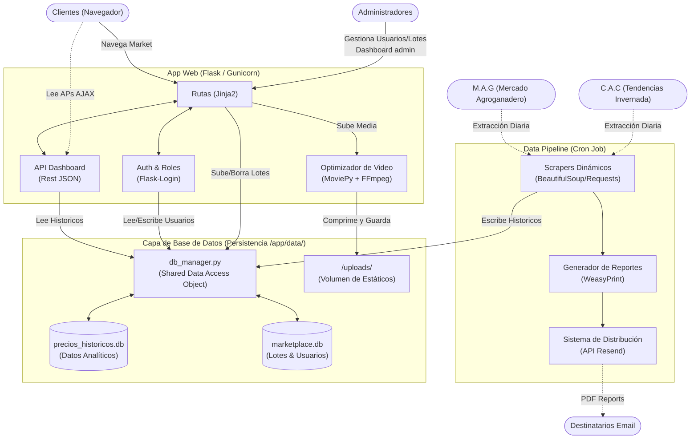

# Diagrama de Arquitectura: Ortiz Consignataria

Este documento visualiza el flujo y la estructura del **Monorepo** y su conexión transversal usando bases de datos SQLite como pasarela persistente bajo contenedores.

## Referencias Claves del Diseño
1. **Desacoplamiento de Escalado**: El *Data Pipeline* puede correr en un cron job completamente desconectado del proceso maestro de Gunicorn (*App Web*).
2. **`db_manager.py` como Puente**: Todas las transacciones SQL puras pasan obligatoriamente por el manager compartido, previniendo cuellos de botella e hilos no cerrados.
3. **Volumen Único**: Puesto que se monta usando contenedores (p.ej en Railway), tanto los archivos multimedia ubicados en `/uploads/` como las bases `.db` se persistirán sobre ciclos destructivos de redespliegue.
